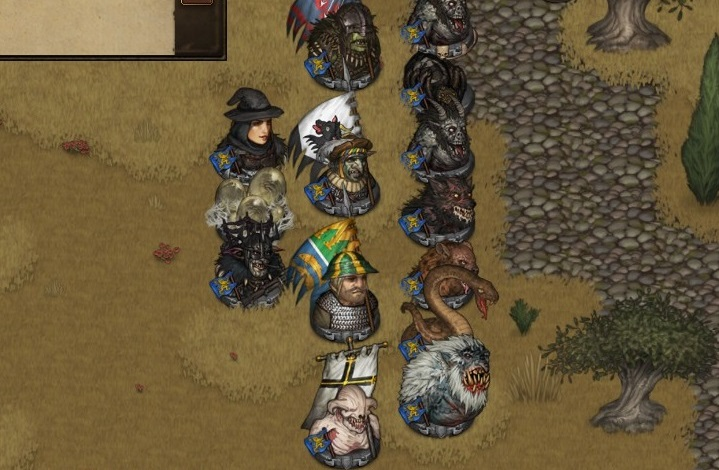
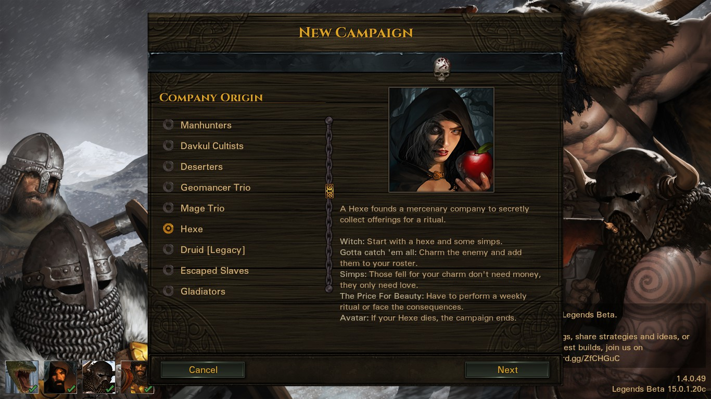

# NgGH-Magic-Origins-Mod
A mod of Battle Brother that brings out new unqiue origins and new mechanism

## Description
Added 7 new unique origins: Mage trio, Geomancer Trio, Necromancer Trio, Spellknight, Hexe and Custom Origin. And a playable non-human character system.

* Mage trio: Start with 3 mages with amazing power and a runestone. You will choose one of four runestones once the map is generated. Can hire more mages with 50% less cost. (Status: Finished)

* Geomancer Trio: Start with 3 player character geomancers who can control stone and sand as their puppet. The campaign will end if all three starting geomancers die. (Status: Finished)

* Necromancer Trio: Start with 3 random dark art users. They have a good relationship to a new undead faction and can perform resurrection ritual to create playable undead brother. (Status: Temporarily taken out for rework)

* Spellknight: Pretty much like a lone wolf start but instead of a hedge knightm you get a spellknight (Status: Temporarily taken out for rework)

* Hexe: The cream and butter of this project. A whole new origin where you can charm the enemy to become your playable character. Feel the spirit of "Gotta catch 'em all" from Pokemon, collect your enemy to form a simps army. (Status: Finished)

* Custom Origin: A origin where you can start a campaign with many more setting to customize, get the starting character you want. (Status: Hasn't finished)

Beside these origin, you can find my new mages background from villages, towns and cites though quite rare and expensive. You may also be able to recruit a hexe when accepting "Protect Firstborn" contract

There will be an upcoming new faction - The Necro Guild - where you can trade, accept new contracts. This faction is only friendly with certain origins by default, to get the permission to enter their land you must earn it. (Status: Hasn't finished)

## Requirements
* Battle Brothers with all DLC installed, version 1.4.0.49
* Legends mod, the latest version from [BB Legends Mod Discord Server](https://discord.gg/aErQSMhZ)
* mod_nggh_magic_origins_legends.zip, the latest version

## Usage
To install this mod you should do step-by-step:
1. Download and install the latest "Battle Brothers" game.
2. Download and install the latest "Legends" mod.
3. Download the latest directory from "NgGH-Magic-Origins-Mod" release repo: [release link](https://github.com/NgGH707/NgGH-Magic-Origins-Mod/releases/)
4. Put mod into the "data" dir (you should put zip without unzipping).
5. All done, now just run the game.

## License, Authors and Copyright

This repository is used for private mod Battle Brothers game and as a submod for Legends mod.

This file is part of the NgGH-Magic-Expansion Project. 

AUTHORS: NgGH707.

CREDITS:
* Wuxiang - For many great feedback and new ideas
* Leon - Grammar correction.
* Misha - Artworks for background icons, entity sprites.
* Neon - Edit and write event text.
* GRIBABAS - Artworks for named staves
* Enke - Artworks for the new upcoming necromancer faction

COPYRIGHT: Reprint or usage of materials/scripts from this repository is permitted only with the consent of the owner. Many sprites and images used in this mod aren't mine, i don't own them. All rights reserved to their rightful owner and their licensors.

Battle Brothers content and materials are trademarks and copyrights of Overhype Studios or its licensors. All rights reserved. This mod project is not affiliated with Overhype Studios or its licensors.
